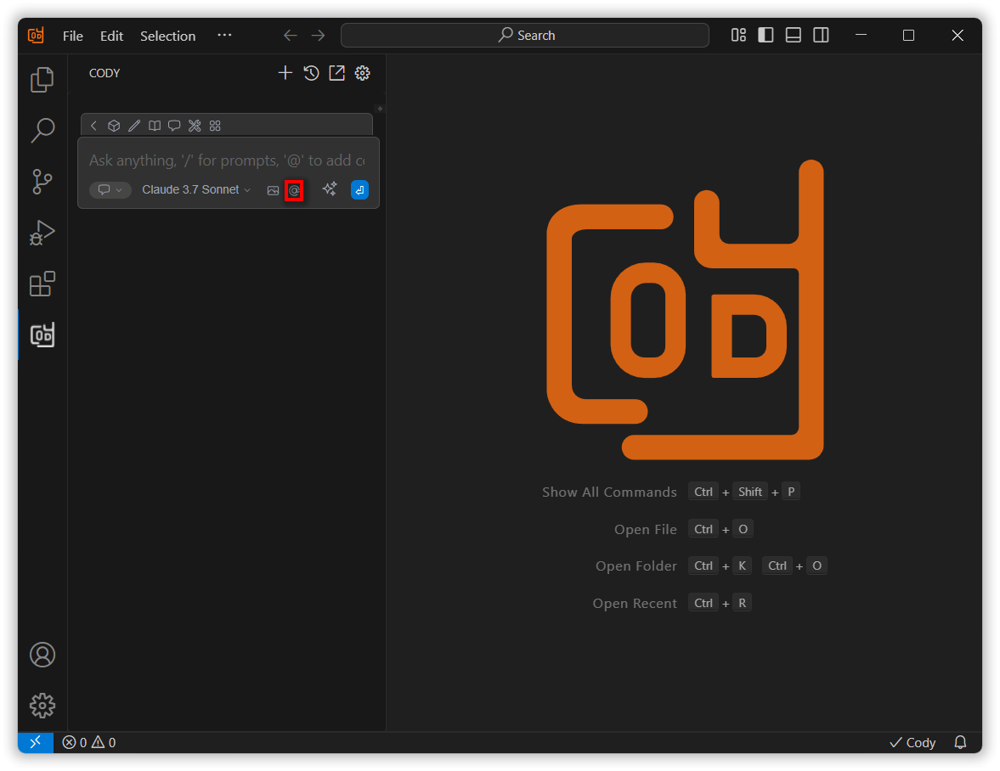
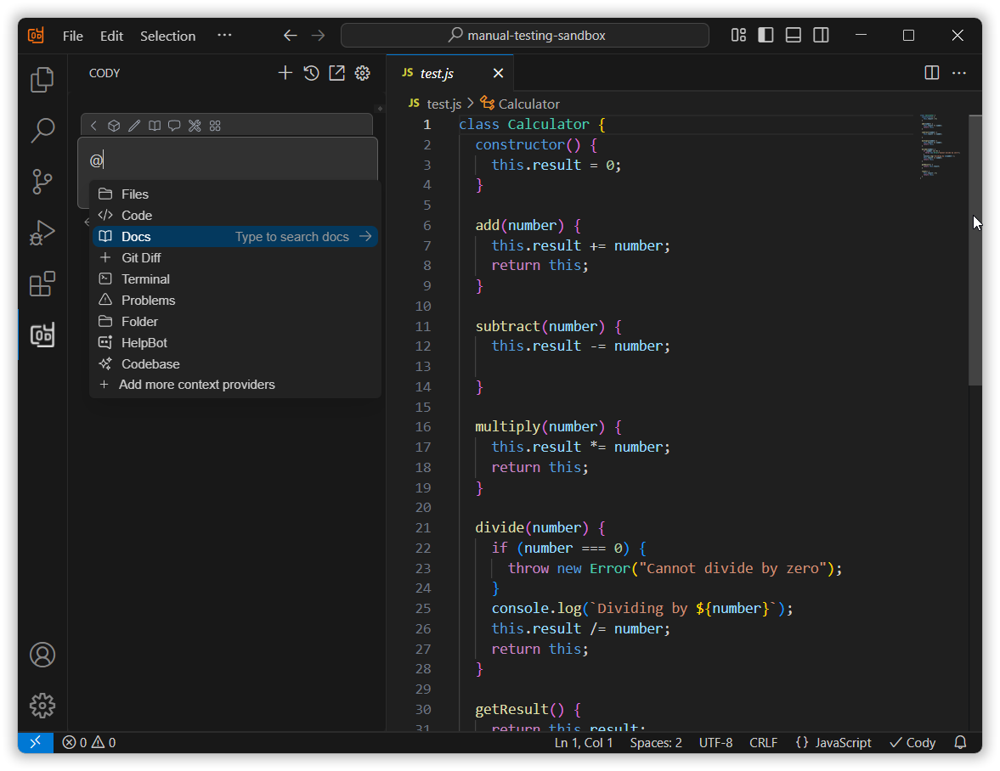
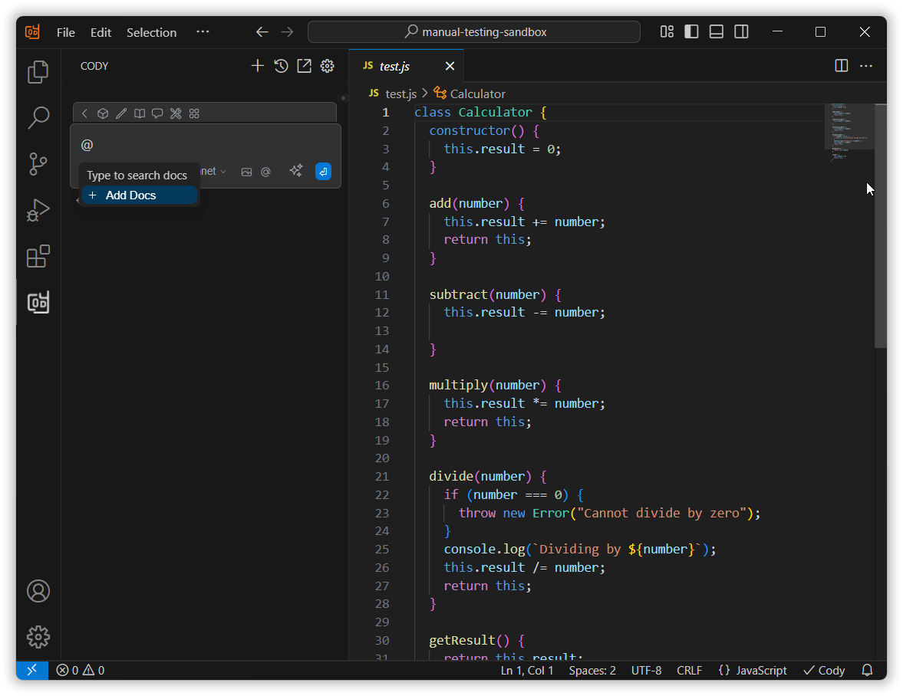
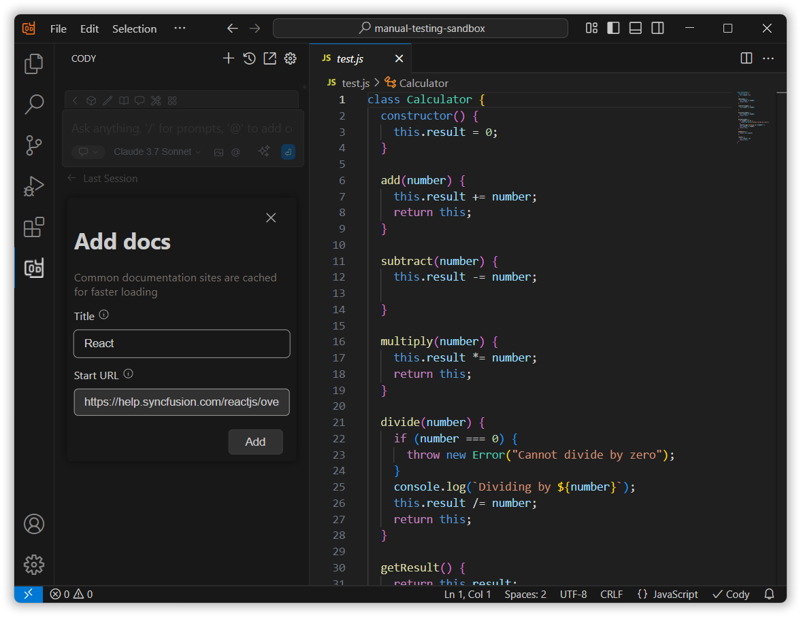
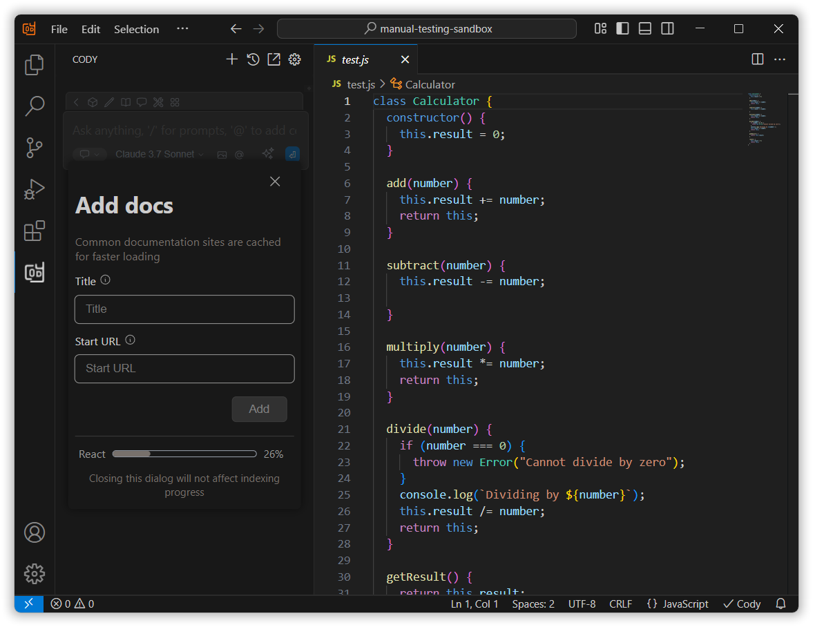
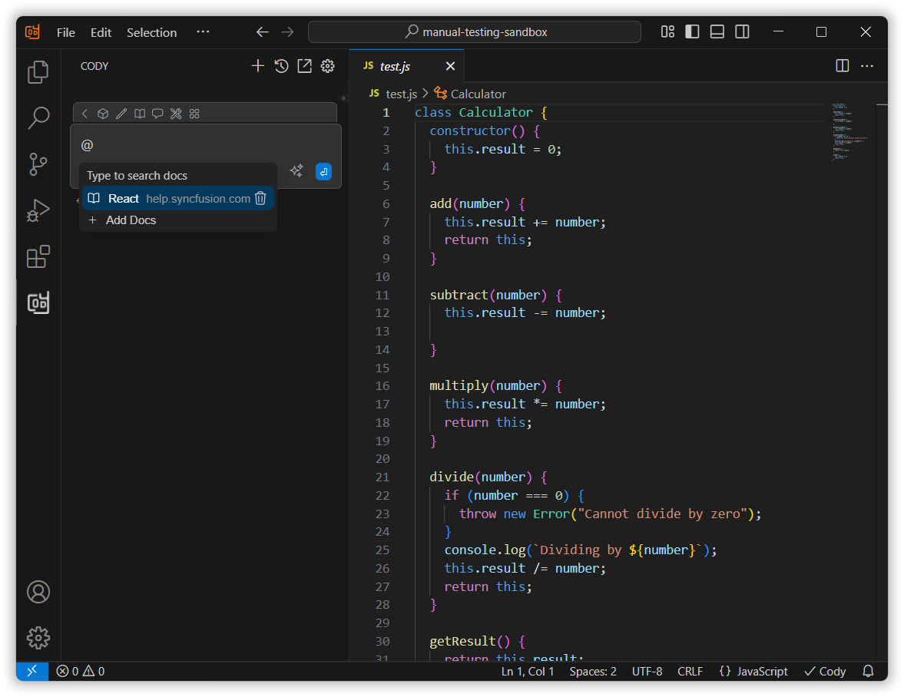
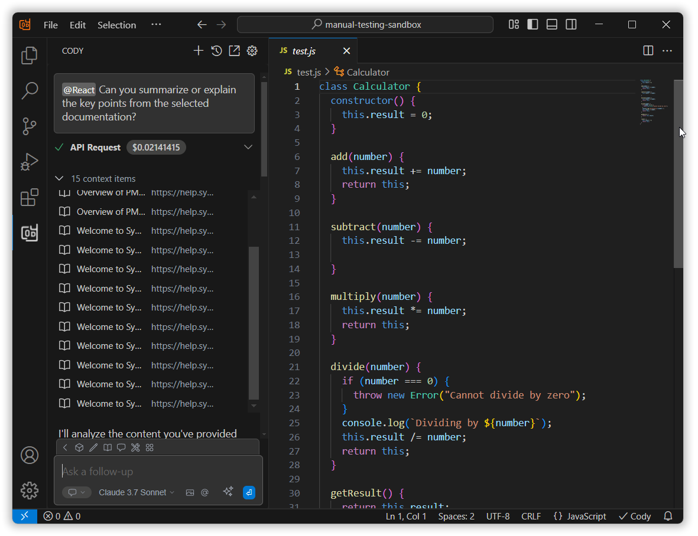

# @Docs Context Feature Overview

The @Docs context provider lets you easily reference content from any documentation site directly within Syncfusion Code Studio, making it more efficient to get help and insights based on the documents you're working with.

## How to Use the @Docs Context

### 1. Open the Syncfusion Code Studio

In the Syncfusion Code Studio, the chat interface is located on the left-hand side. This is where you can interact with AI and ask questions or get assistance.

### 2. Select @Docs context

In the chat window, click the “@” button and select @Docs from the menu.  

  

**Note:**   If you cannot locate the @Docs context option in the list, you will need to add it manually to include this context provider in config.yaml file. Please follow the steps outlined in this [link](/syncfusion-cody/features/context-providers/add-more-contextproviders/How-to-configure-more-contextproviders.md) to do so.

Click **Add Docs**, enter the title and URL, then click **Add** to save it.

Syncfusion Code Studio generates embeddings from chunked content and stores them locally.

### 3. Use @Docs Context with Query

The document will appear in the list—select the one you want to use.

Press **Enter**, and the AI will respond based on the selected documentation and query.

