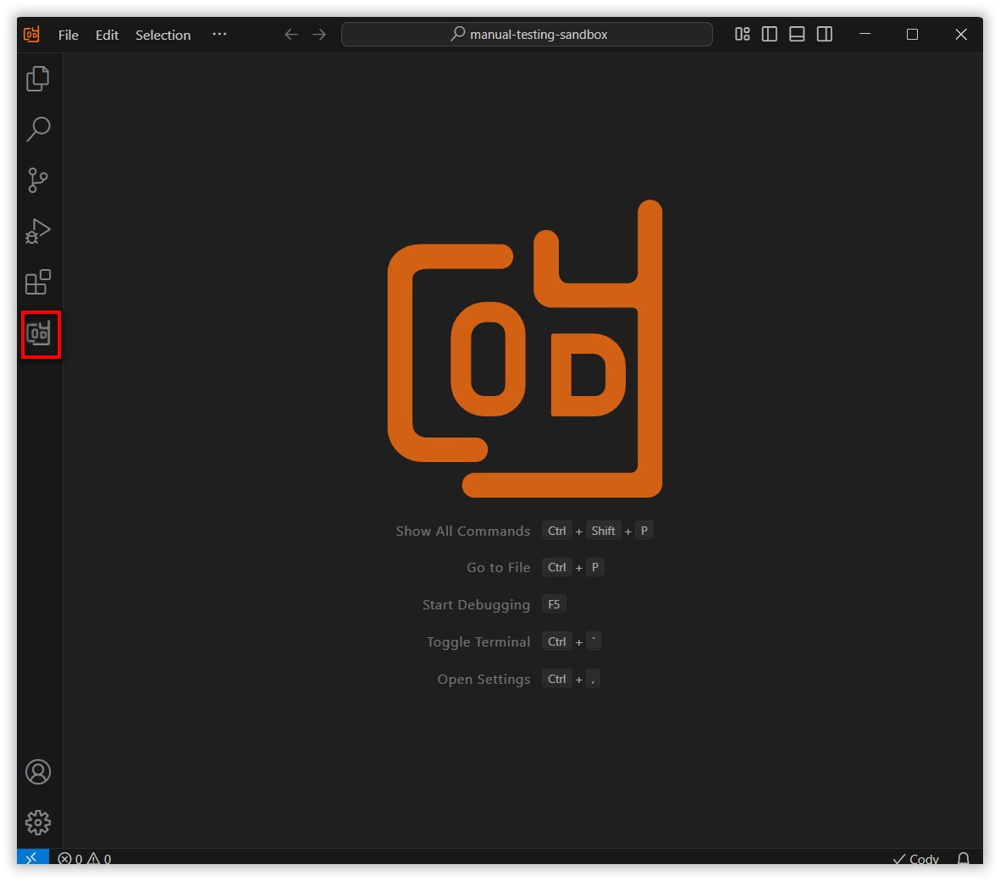

 
# @Clipboard Context Feature Overview
 
The @Clipboard context option in the Syncfusion Code Studio enables users to easily incorporate recently copied content from editor files into their AI conversations, improving context and productivity.
 
## How to Use the @Clipboard Context
 
### Open the Syncfusion Code Studio
 
In the Syncfusion Code Studio, the chat interface is located on the left-hand side. This is where you can interact with AI and ask questions or get assistance.

 
### Select @Clipboard context
 
In the chat window, click the “@” button.

Note: If you cannot locate the @Clipboard context option in the list, you will need to add it manually to include this context provider, Please follow the steps outlined in this [link](/syncfusion-cody/features/context-providers/add-more-contextproviders/How-to-configure-more-contextproviders.md) to do so.

Select @clipboard from the list of context providers.
 
It will show recently copied clipboard contents one by one into your conversation.

Select the necessary copied content you need from the copied clipboard contents list.  
NOTE: Once you close the Syncfusion Code Studio  and reopen again the copied contents will not show again.  

 
### 3.   Use @Clipboard context with query
 
After selecting the copied content, input relevant details about the copied content in the chat model window and click Enter. You will get the results.

