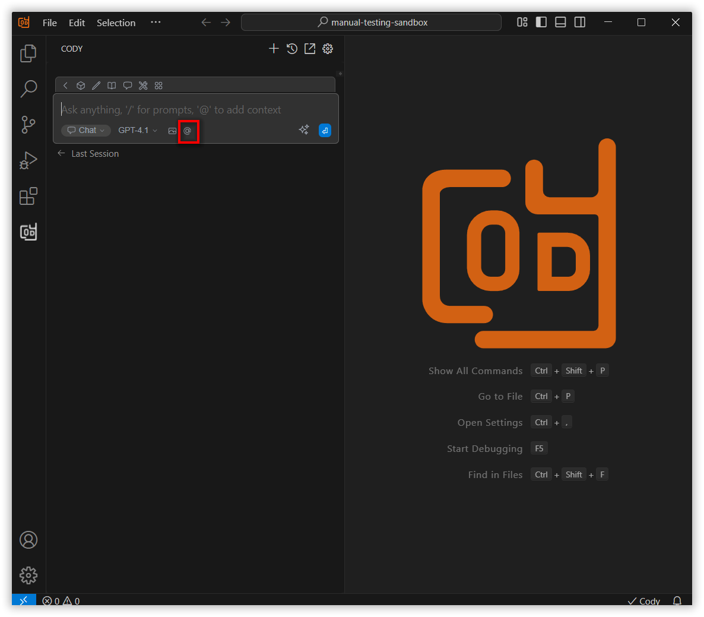

 
# @Debugger Context Feature Overview
 
The @Debugger context option in Syncfusion Code Studio allows you to enhance your development experience by seamlessly integrating debugging capabilities into your workflow. A key feature is the @Debugger context option, which enables users to share relevant local variables from the active debugging session directly in the chat window.
 
## How to Use the @Debugger Context
 
### Open the Syncfusion Code Studio
 
In the Syncfusion Code Studio, the chat interface is located on the left-hand side. This is where you can interact with AI and ask questions or get assistance.

 
### Select @Debugger context
 
In the chat window, click the “@” button.  
Note: If you cannot locate the @Debugger context option in the list, you will need to add it manually to include this context provider. Please follow the steps outlined in this [link](/syncfusion-cody/features/context-providers/add-more-contextproviders/How-to-configure-more-contextproviders.md) to do so.

 
A menu will appear—Select @Debugger from the list of contexts to embed debug output into your conversation.

 
### 3. Use @Debugger context with query
 
The @Debugger option is only available when your source code is running in debug mode and has hit a breakpoint. Once the breakpoint is reached, you can use the @Debugger in the context provider.  
You can then use the Step Over and Step Into options to view detailed information about the variables at each step of the debugging process.  
AI will now have access to this context, and any suggestions or assistance will be tailored based on the local variables shared.

