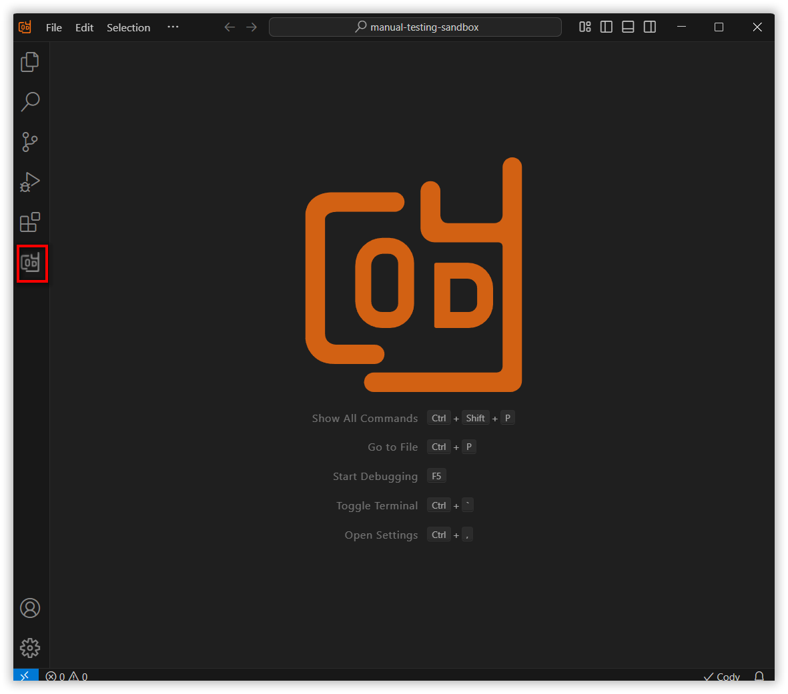
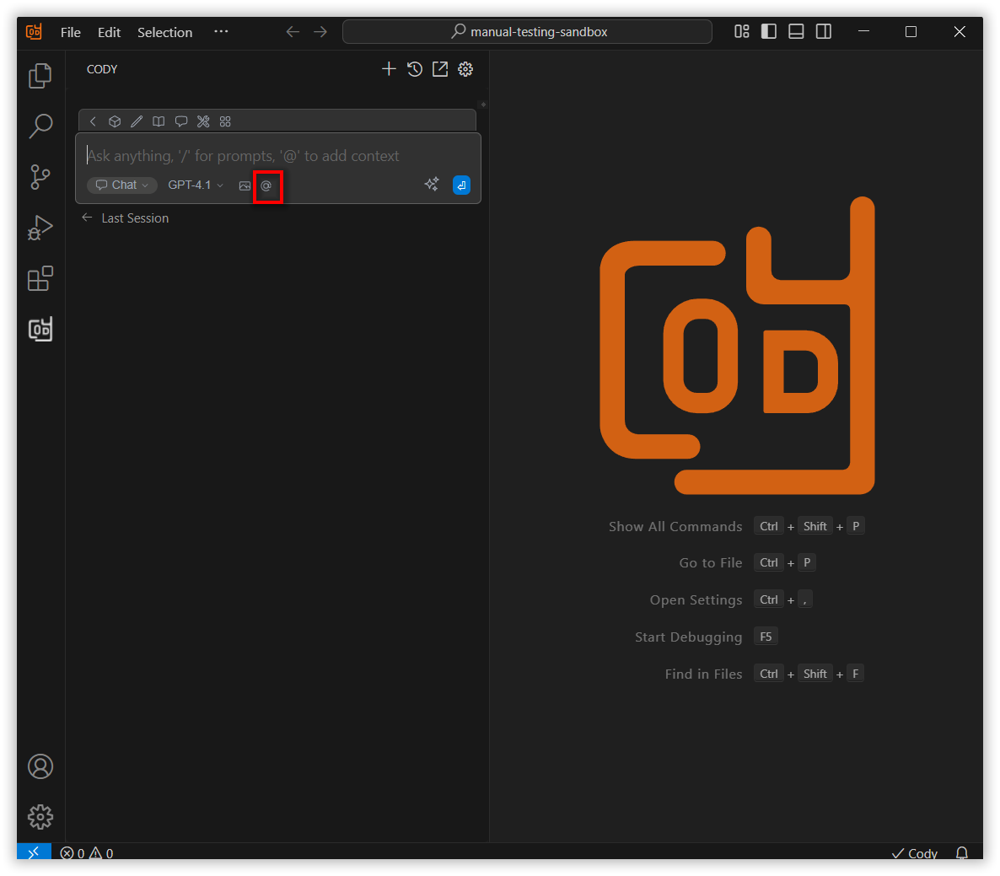
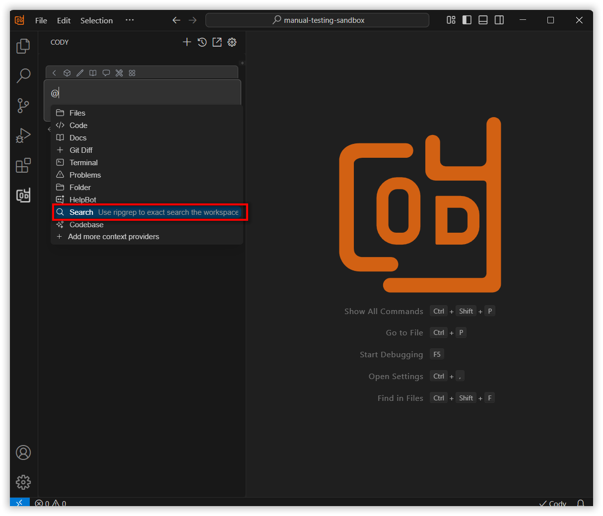
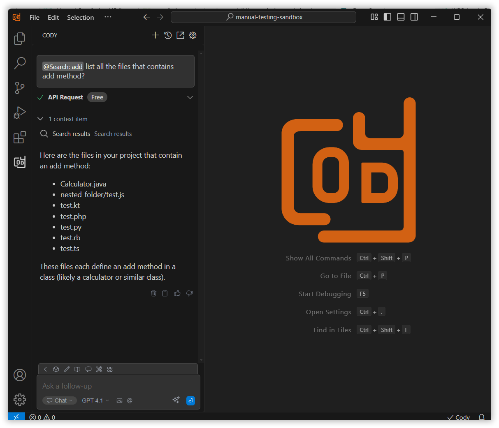

 
# @Search Context Feature Overview
 
The @Search context option in the Syncfusion Code Studio allows users to perform precise searches across their codebase or documentation. It is particularly useful for developers and content creators who need to quickly locate specific strings, functions, or variables.
 
## How to Use the @ExactSearch Context
 
### Open the Syncfusion Code Studio
 
In the Syncfusion Code Studio, the chat interface is located on the left-hand side. This is where you can interact with AI and ask questions or get assistance.

 
### Select @ExactSearch context
 
In the chat window, click the “@” button.  
Note: If you cannot locate the @Search context option in the list, you will need to add it manually to include this context provider. Please follow the steps outlined in this [link](/syncfusion-cody/features/context-providers/add-more-contextproviders/How-to-configure-more-contextproviders.md) to do so.

 
A menu will appear—select @Search.

 
### 3. Use @Search context with query
 
Input relevant details about the query in the chat model window and click Enter.  
This allows you to review how the search object is defined and used throughout the project.

