# Installation on Windows

The installation process for **Syncfusion Cody IDE** is straightforward and user-friendly. Simply download the installer from the official Syncfusion website, follow the on-screen instructions to complete the installation, and then launch the IDE. Once installed, you can start using Cody immediately to enhance your development experience.

---

##  Steps to Install Cody IDE

### Step 1: Start Installation

- Visit the official website: [Syncfusion Cody](https://syncfusioncody.com)
- Click on the **Download** button to obtain the installer for Windows.
- Double-click the installer to begin the installation process.
- The installation wizard will appear on the screen.

###  Step 2: Accept the Agreement

- Carefully read the **License Agreement**.
- To proceed, select the **"I accept the agreement"** checkbox and click **Next**.

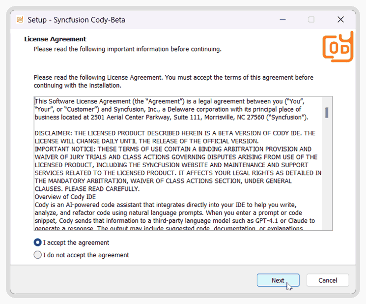

###  Step 3: Choose the Installation Folder

- By default, the IDE will be installed in the `Program Files` directory.
- To change the location, click **Browse** and select your preferred folder.
- Click **Next** once done.

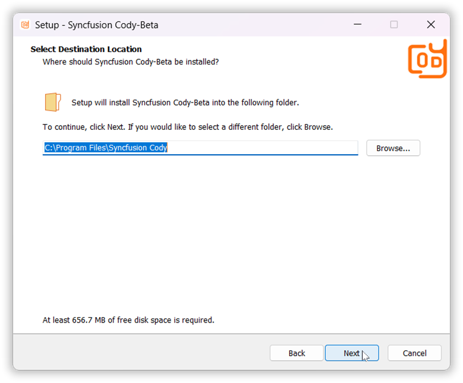

### Step 4: Set Start Menu Folder

- You can specify the folder name that will appear in the **Start Menu**.
- You can also choose **not** to create a Start Menu folder by selecting the checkbox.
- Click **Next** to continue.

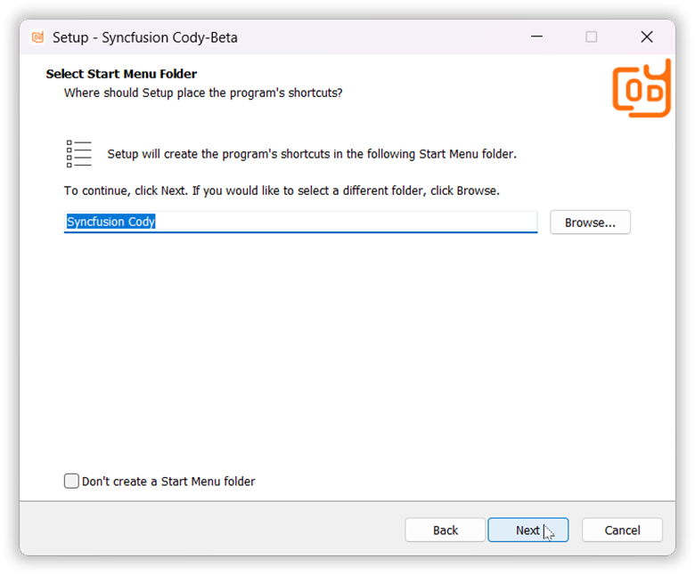

### Step 5: Select Additional Tasks

- You may be prompted to create a **desktop shortcut** or enable additional features.
- Select the tasks you want and click **Next**.

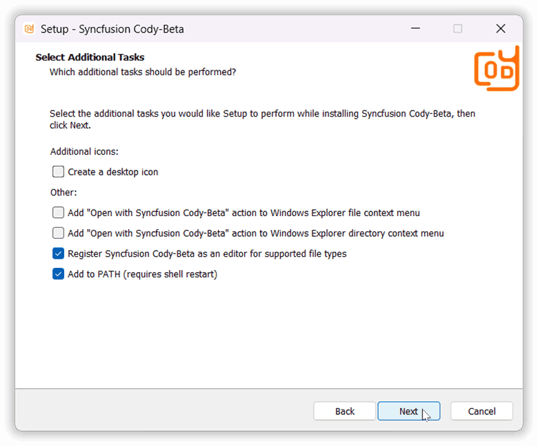

### Step 6: Install the IDE

- Review your chosen settings and click **Install** to start the process.
- A progress bar will indicate the installation status.

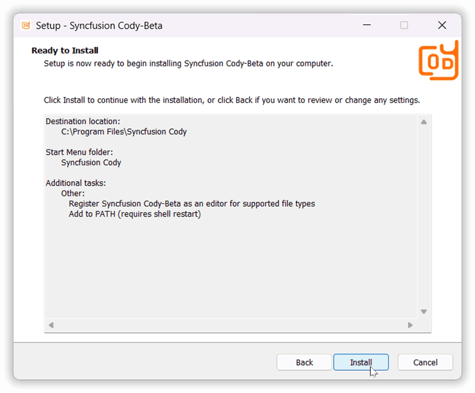

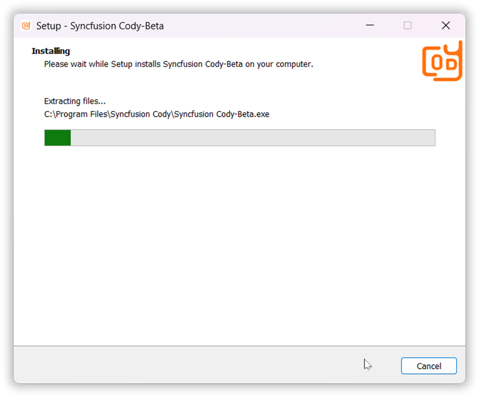

###  Step 7: Completion

- Once the installation is complete, you will see a confirmation screen.
- Click **Finish** to exit the wizard and launch the IDE.

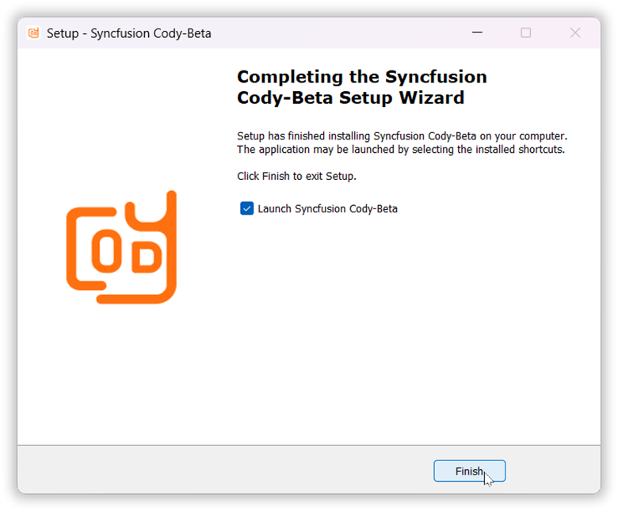

---

##  Step 8: Launch the IDE

After installation, the IDE launches with a **Welcome Page** to help you get started.

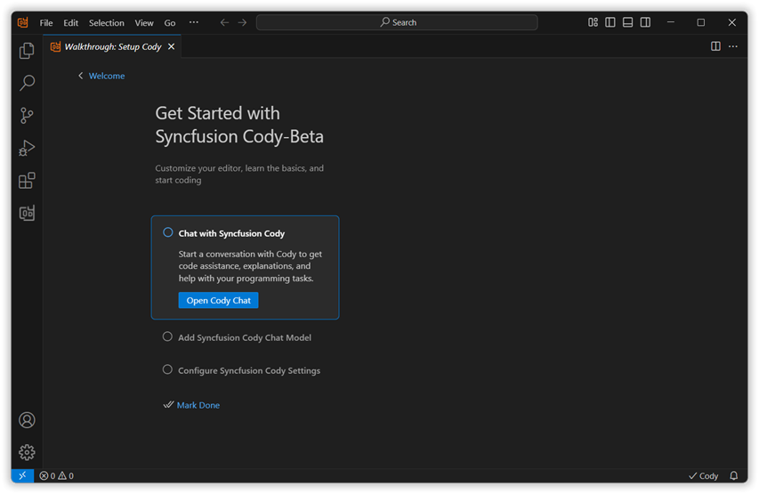

###  Open Chat Page

- Start a new chat session to interact with **Cody** directly.

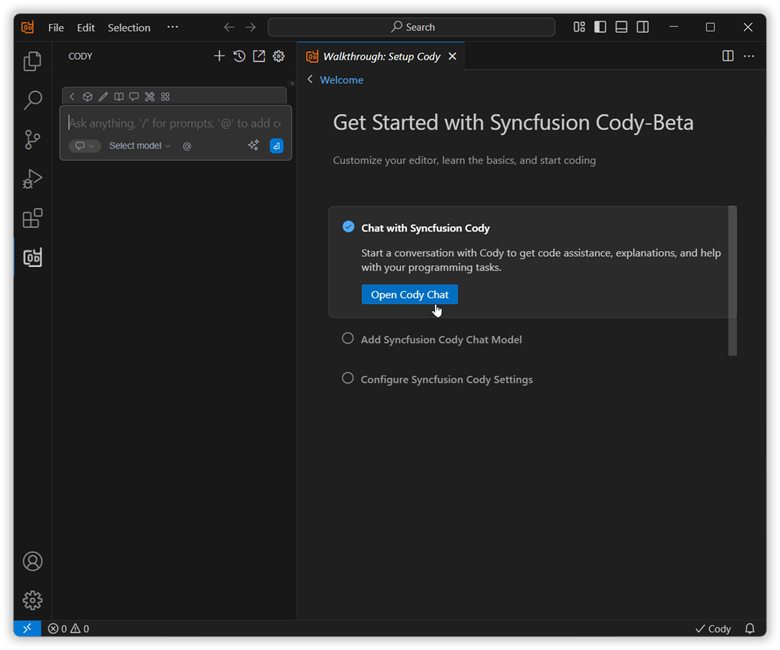

### Add Chat Model

- Open a popup to configure your AI model, including provider, model name, and API key. 

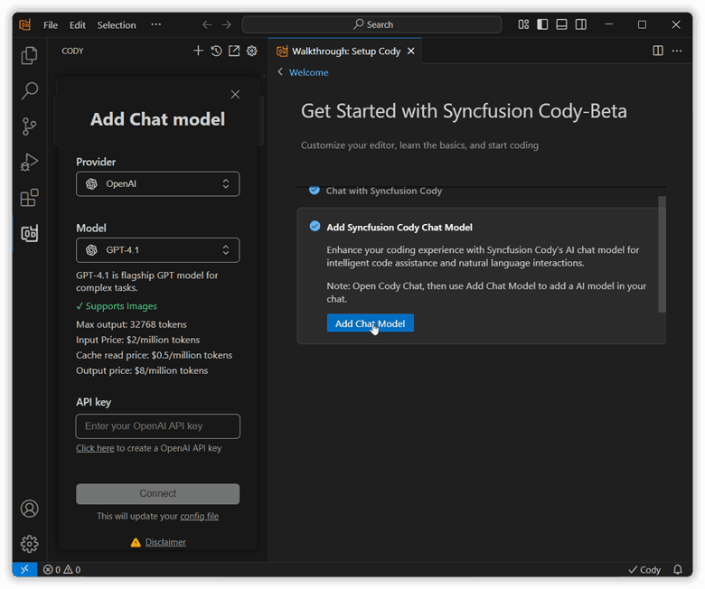

- You can select the provider from the dropdown

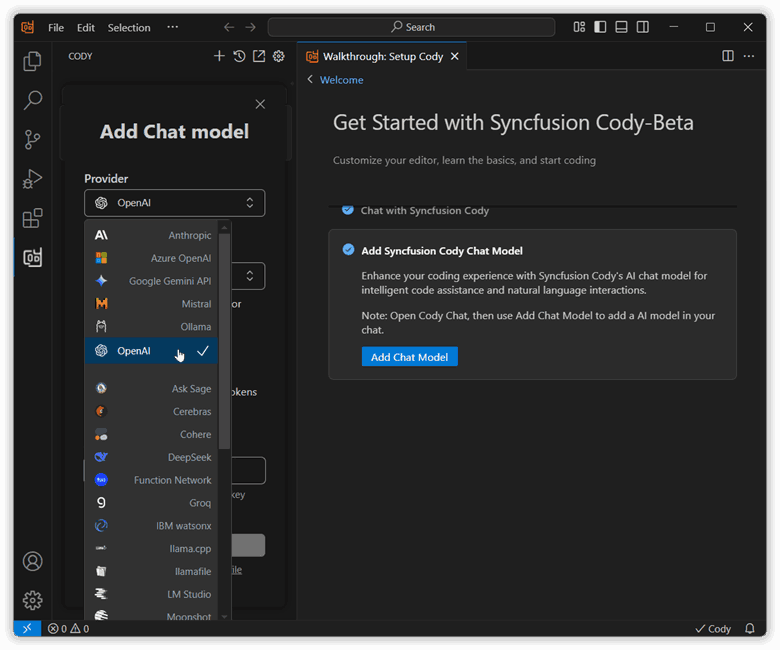

- You can select the Model from the dropdown

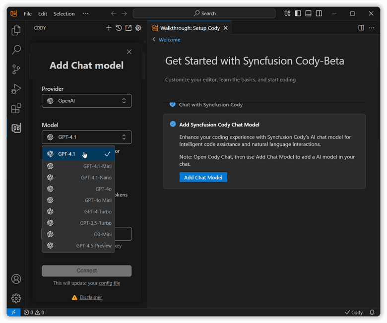

- Enter the API key to connect the model with the selected provider and click connect button.

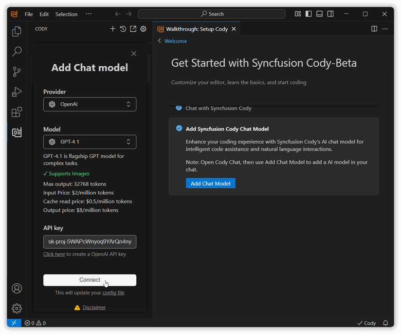

- Now, the selected model has been added and is displayed in the chat box

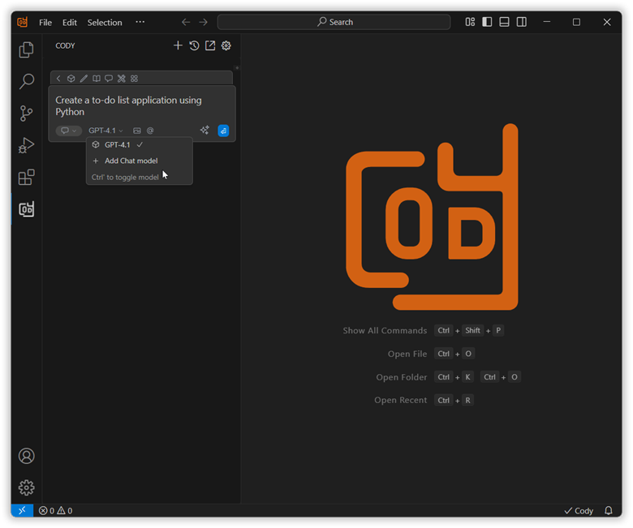

- Ready for integration within your development environment

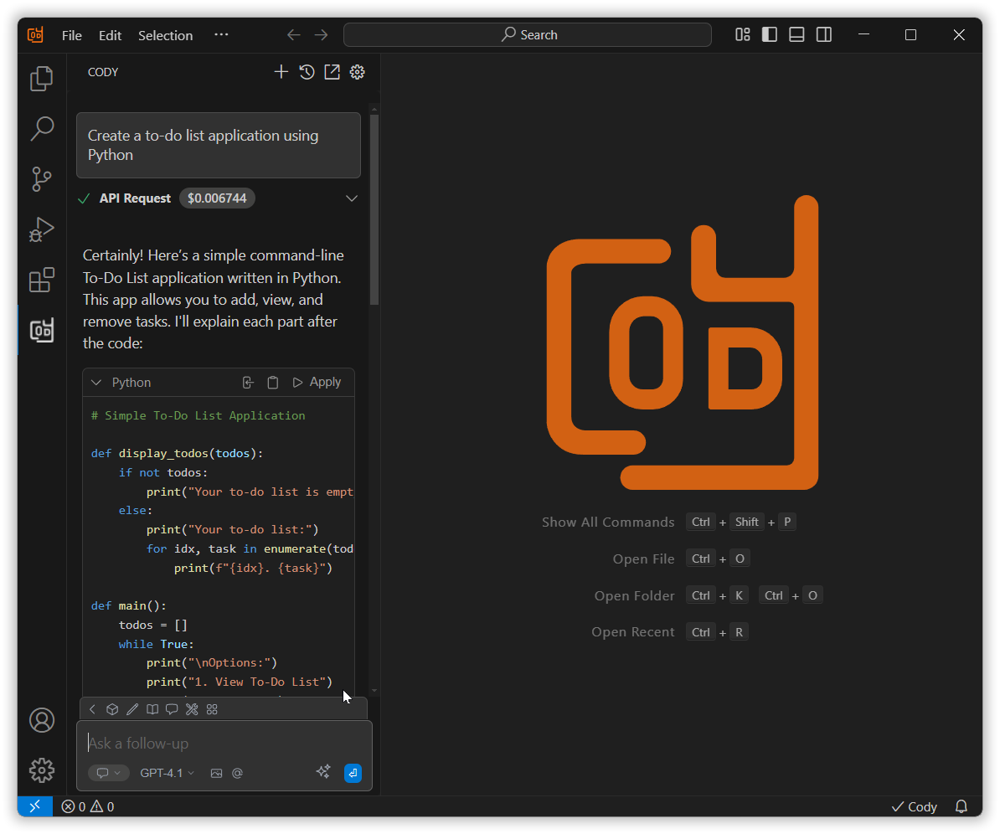

---

## System Requirements

- **Operating System**: Windows 10 or later
- **Processor**: Intel Core i5 or equivalent (minimum)
- **RAM**: 8GB (minimum), 16GB (recommended)
- **Disk Space**: 2GB of available space
- **Display**: 1366 x 768 or higher resolution

## Additional Resources

- [Troubleshooting Installation Issues](/troubleshooting/installation)
- [Getting Started Guide](/get-started/first-steps)
- [Video Tutorial: Installation Process](https://www.syncfusion.com/videos/cody-installation)